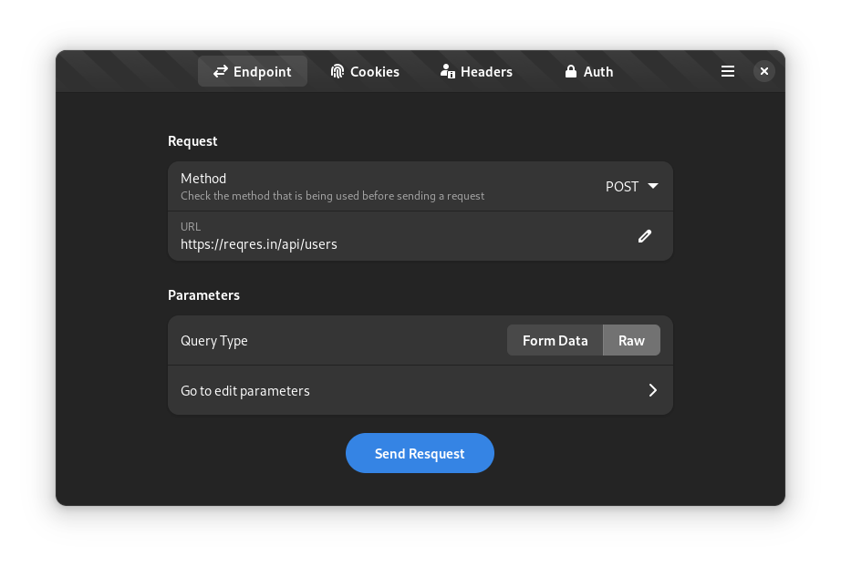

<!-- Based on Burn My Window README -->
# <center> Escambo</center>

<p align="center">Escambo is an HTTP-based APIs test application made in GTK4/Libadwaita.</p>

<p align="center">
  </a>
</p>

## 🏗️ Build

#### We need the following resources:

- org.gnome.Sdk
- flatpak-builder

#### Clone, build and run:

Clone the latest Escambo source from GitHub

```bash
git clone https://github.com/CleoMenezesJr/escambo.git
```

Enter the directory and build

```bash
cd escambo
flatpak-builder build io.github.cleomenezesjr.Escambo.json --user --install --force-clean
```

Run

```bash
cd escambo
flatpak run io.github.cleomenezesjr.Escambo
```

That's it!

## :octocat: I want to contribute!

That's great!

Here are some basic rules to get you started:
Commits should start with a Capital letter and should be written in present tense (e.g. **:tada: Add cool new feature** instead of **:tada: Added cool new feature**).
You should also start your commit message with **one** applicable emoji.
This does not only look great but also makes you rethink what to add to a commit. Make many but small commits!

| Emoji                                                     | Description                                                               |
| --------------------------------------------------------- | ------------------------------------------------------------------------- |
| :tada: `:tada:`                                           | When you added a cool new feature.                                        |
| :wrench: `:wrench:`                                       | When you added a piece of code.                                           |
| :recycle: `:recycle:`                                     | When you refactored a part of the code.                                   |
| :sparkles: `:sparkles:`                                   | When you applied code-format.                                             |
| :globe_with_meridians: `:globe_with_meridians:`           | When you worked on translations.                                          |
| :art: `:art:`                                             | When you improved / added assets like themes.                             |
| :lipstick: `:lipstick:`                                   | When you worked on the UI of the preferences dialog.                      |
| :rocket: `:rocket:`                                       | When you improved performance.                                            |
| :memo: `:memo:`                                           | When you wrote documentation.                                             |
| :beetle: `:beetle:`                                       | When you fixed a bug.                                                     |
| :revolving_hearts: `:revolving_hearts:`                   | When a new sponsor is added or credits are updated.                       |
| :heavy_check_mark: `:heavy_check_mark:`                   | When you worked on checks or adjusted the code to be compliant with them. |
| :twisted_rightwards_arrows: `:twisted_rightwards_arrows:` | When you merged a branch.                                                 |
| :fire: `:fire:`                                           | When you removed something.                                               |
| :truck: `:truck:`                                         | When you moved / renamed something.                                       |
